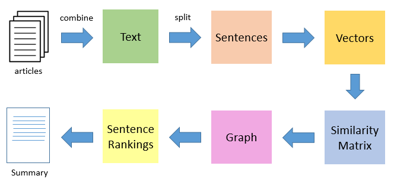

R语言自然语言处理：关键词提取与文本摘要（TextRank）
================

关于提取关键词的方法，除了TF-IDF算法，比较有名的还有TextRank算法。它是基于PageRank衍生出来的自然语言处理算法，是一种基于图论的排序算法，以文本的相似度作为边的权重，迭代计算每个文本的TextRank值，最后把排名高的文本抽取出来，作为这段文本的关键词或者文本摘要。之所以提到关键词和文本摘要，两者其实宗旨是一样的，就是自动化提取文本的重要表征文字。



如果分词是以词组作为切分，那么得到的是关键词。以词作为切分的时候，构成词与词之间是否连接的，是词之间是否相邻。相邻关系可以分为n元，不过在中文中，我认为2元关系已经非常足够了（比如一句话是：“我/有/一只/小/毛驴/我/从来/也/不/骑”，那么设置二元会让“一只”和“毛驴”发生关联，这就足够了）。如果是以句子切分的，那么得到的称之为文本摘要（其实就是关键的句子，俗称关键句）。如果要得到文本的关键句子，还是要对每句话进行分词，得到每句话的基本词要素。根据句子之间是否包含相同的词语，我们可以得到句子的相似度矩阵，然后再根据相似度矩阵来得到最关键的句子（也就是与其他句子关联性最强的那个句子）。当句子比较多的时候，这个计算量是非常大的。 下面，我要用R语言的textrank包来实现关键词的提取和文本摘要。

准备工作
--------

安装必备的包。

``` r
library(pacman)
p_load(tidyverse,tidytext,textrank,rio,jiebaR)
```

然后，导入数据。数据可以在我的github中获得（<https://github.com/hope-data-science/chinese_NLP/tree/master/R%E8%AF%AD%E8%A8%80%E5%85%B3%E9%94%AE%E8%AF%8D%E6%8F%90%E5%8F%96>）。文件名称为hire\_text.rda。

``` r
import("./hire_text.rda") -> hire_text
hire_text
```

这里面包含了互联网公司的一些招聘信息，一共有4102条记录，只有一列，列名称为hire\_text，包含了企业对岗位要求的描述。

关键词提取
----------

因为要做关键词和关键句的提取，因此我们要进行分词和分句。分词还是利用jiebaR，老套路。如果没有了解的话，请看专栏之前的文章（R语言自然语言处理系列）。不过这次，我们希望能够在得到词频的同时，得到每个词的词性，然后只把名词提取出来。 分词代码如下：

``` r
hire_text %>% 
  mutate(id = 1:n()) -> hire_txt  #给文档编号

worker(type = "tag") -> wk   #构造一个分词器，需要得到词性

hire_txt %>% 
  mutate(words = map(hire_text,tagging,jieba = wk)) %>%   #给文档进行逐个分词
  mutate(word_tag = map(words,enframe,name = "tag",value = "word")) %>%               
  select(id,word_tag) -> hire_words
```

然后，我们分组进行关键词提取。

``` r
#构造提取关键词的函数

extract_keywords = function(dt){
  textrank_keywords(dt$word,relevant = str_detect(dt$tag,"^n"),ngram_max = 2) %>% 
    .$keywords
}
  
hire_words %>% 
  mutate(textrank.key = map(word_tag,extract_keywords)) %>% 
  select(-word_tag) -> tr_keyword
```

现在我们的数据框中，包含了每个文档的关键词。每个关键词列表中，包含freq和ngram两列，freq代表词频，ngram代表多少个n元，2元就是“上海市-闵行区”这种形式，1元就是“上海市”、“闵行区”这种形式。 现在，我要从中挑选每篇文章最重要的3个关键词。挑选规则是：词频必须大于1，在此基础上，n元越高越好。

``` r
tr_keyword %>% 
  unnest() %>% 
  group_by(id) %>% 
  filter(freq > 1) %>% 
  top_n(3,ngram) %>% 
  ungroup() -> top3_keywords

top3_keywords
```

    ## # A tibble: 3,496 x 4
    ##       id keyword       ngram  freq
    ##    <int> <chr>         <int> <int>
    ##  1     1 上海市-长宁区     2     2
    ##  2     1 长宁区            1     2
    ##  3     1 上海市-静安区     2     2
    ##  4     4 客户              1     4
    ##  5     5 招商银行          1     2
    ##  6     6 事业部            1     3
    ##  7     7 房地产            1     2
    ##  8     9 技术              1     3
    ##  9    10 电商              1     2
    ## 10    10 协调              1     2
    ## # ... with 3,486 more rows

仔细观察发现，有的文档就没有出现过，因为他们分词之后，每个词的词频都是1。现在让我们统计一下最火的十大高频词。

``` r
top3_keywords %>% 
  count(keyword) %>% 
  arrange(desc(n)) %>% 
  slice(1:10)
```

    ## # A tibble: 10 x 2
    ##    keyword     n
    ##    <chr>   <int>
    ##  1 客户      298
    ##  2 公司      173
    ##  3 产品      110
    ##  4 能力       97
    ##  5 项目       89
    ##  6 技术       51
    ##  7 市场       48
    ##  8 系统       48
    ##  9 广告       41
    ## 10 企业       41

这些词分别是：客户、公司、产品、能力、项目、技术、市场、系统、广告、企业。

文本摘要
--------

文本摘要其实就是从文档中提出我们认为最关键的句子。我们会用textrank包的textrank\_sentences函数，这要求我们有一个分句的数据框，还有一个分词的数据框（不过这次需要去重复，也就是说分词表中每个文档不能有重复的词）。非常重要的一点是，这次分词必须以句子为单位进行划分。 我们明确一下任务：对每一个招聘文档，我们要挑选出这个文档中最关键的一句话。要解决这个大问题，需要先解决一个小问题。就是对任意的一个长字符串，我们要能够切分成多个句子，然后按照句子分组，对其进行分词。然后我们会得到一个句子表格和单词表格。 其中，我们切分句子的标准是，切开任意长度的空格，这在正则表达式中表示为“\[:space:\]+”。

``` r
get_sentence_table = function(string){
  string %>% 
    str_split(pattern = "[:space:]+") %>% 
    unlist %>% 
    as_tibble() %>% 
    transmute(sentence_id = 1:n(),sentence = value)
}
```

上面这个函数，对任意的一个字符串，能够返回一个含有两列的数据框，第一列是句子的编号sentence\_id，另一列是句子内容sentence。我们姑且把这个数据框称之为sentence\_table。 下面我们要构造另一个函数，对于任意的sentence\_table，我们需要返回一个分词表格，包含两列，第一列是所属句子的编号，第二列是分词的单词内容。

``` r
wk = worker()  #在外部构造一个jieba分词器

get_word_table = function(string){
  string %>% 
    str_split(pattern = "[:space:]+") %>% 
    unlist %>% 
    as_tibble() %>% 
    transmute(sentence_id = 1:n(),sentence = value) %>% 
    mutate(words = map(sentence,segment,jieba = wk)) %>% 
    select(-sentence) %>% 
    unnest()
}
```

如果分词器要在内部构造，每次运行函数都要构造一次，会非常消耗时间。 目前，对于任意一个字符串，我们有办法得到它的关键句了。我们举个例子：

``` r
hire_text[[1]][1] -> test_text
test_text %>% get_sentence_table -> st
st %>% get_word_table -> wt
```

    ## Warning in stri_split_regex(string, pattern, n = n, simplify = simplify, :
    ## argument is not an atomic vector; coercing

有了这st和wt这两个表格，现在我们要愉快地提取关键句子。

``` r
textrank_sentences(data = st,terminology = wt) %>% 
  summary(n = 1)  #n代表要top多少的关键句子
```

    ## [1] "1279弄6号国峰科技大厦"

我们给这个取最重要关键句子也编写一个函数。

``` r
get_textrank_sentence = function(st,wt){
  textrank_sentences(data = st,terminology = wt) %>% 
  summary(n = 1)
}
```

因为数据量比较大，我们只求第10-20条记录进行求解。不过，如果句子只有一句话，那么是会报错的。因此我们要首先去除一个句子的记录。

``` r
hire_txt %>% 
  slice(10:20) %>% 
  mutate(st = map(hire_text,get_sentence_table)) %>% 
  mutate(wt = map(hire_text,get_word_table)) %>% 
  mutate(sentence.no = unlist(map(st,nrow))) %>% 
  select(-hire_text) %>% 
  filter(sentence.no != 1) %>% 
  mutate(key_sentence = unlist(map2(st,wt,get_textrank_sentence))) %>% 
  select(id,sentence.no,key_sentence) -> hire_abstract
 
hire_abstract
```

    ## # A tibble: 10 x 3
    ##       id sentence.no key_sentence                                         
    ##    <int>       <int> <chr>                                                
    ##  1    10           9 开拓电商行业潜在客户                                 
    ##  2    11           5 EHS                                                  
    ##  3    12           9 负责招聘渠道的维护和更新；                           
    ##  4    13           6 荣获中国房地产经纪百强企业排名前六强；               
    ##  5    14           7 2、逻辑思维、分析能力强，工作谨慎、认真，具有良好的书面及语言表达能力；~
    ##  6    15           5 2、能独立完成栏目包装、影视片头、广告片、宣传片的制作，包括创意图设计、动画制作、特效、剪辑合成等工作；~
    ##  7    16           7 3、公司为员工提供带薪上岗培训和丰富的在职培训，有广阔的职业发展与晋升空间；~
    ##  8    17           7 您与该职位的匹配度?                                  
    ##  9    18          13 接触并建立与行业内重点企业的良好关系，及时了解需求状态;~
    ## 10    20           7 具有财务、金融、税务等领域专业知识；具有较强分析判断和解决问题的能力；~

如果对所有记录的摘要感兴趣，去掉`slice(10:20) %>%`这一行即可。等待时间可能会较长。

参考资料
--------

[textrank包基本教程](https://cran.r-project.org/web/packages/textrank/vignettes/textrank.html)
[手把手 | 基于TextRank算法的文本摘要（附Python代码）](http://blog.itpub.net/31562039/viewspace-2286669/)
