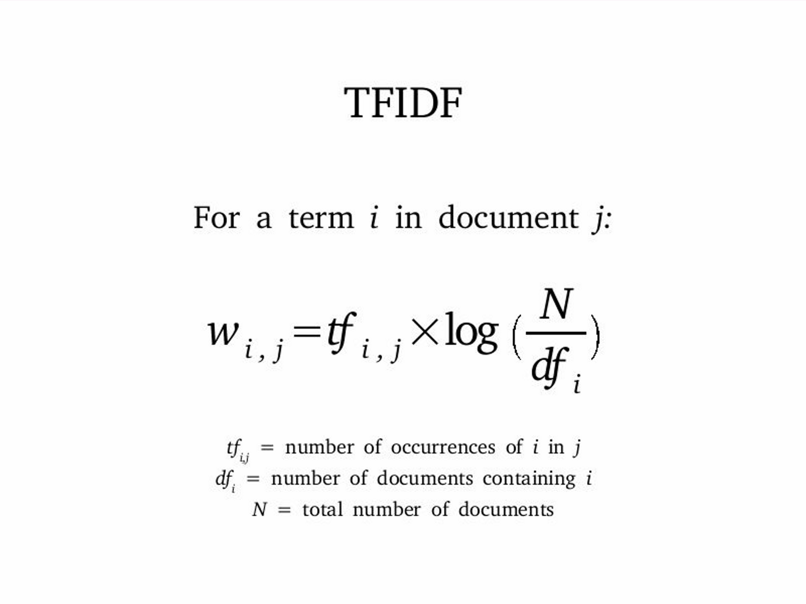
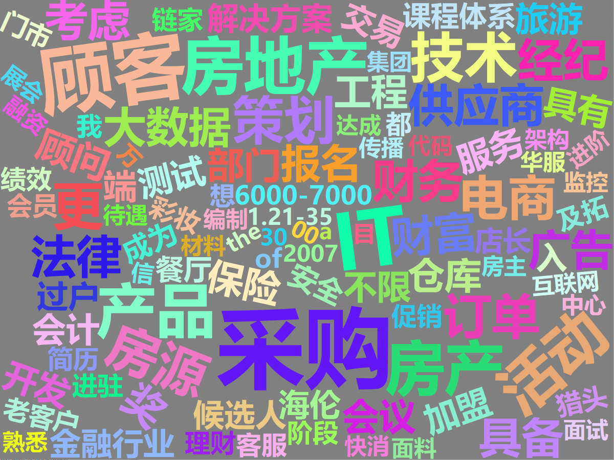

  本文希望诠释如何利用TF-IDF方法对文本中的关键词进行提取。关键词提取的输入是一大段文本材料，输出是少数的关键词。比如我们日常看的论文，会有关键词。但是这些一般都是作者自己根据文章内容，向杂志社提供的关键词。事实上，如果有了正文的文本，我们完全可以利用计算机自动提取关键词（在一些数据库中，这些关键词的名称叫做Index Keywords，即索引关键词，区别于作者关键词Author Keywords）。
  从海量的文本文档中，提取少量表征其内容的关键词，这就是关键词提取的主要任务。掌握了这项技能，能够自动化地给文本贴标签，非常有用。根据大部分从业者和学界的实践证明，TF-IDF算法能够解决大部分的关键词抽取场景，简单有效，其实大部分能够做文章的地方不是在算法，而是在中文分词和词性标注的部分。所以，掌握这个简单有效的方法，并利用它来做关键词提取，是非常重要的。本文会首先对TF-IDF算法做简要介绍，然后提供这个算法在R语言中的实现代码。
  
## TF-IDF简介  
  TF-IDF的基本思想是：词语的重要性与它在文件中出现的次数成正比，但同时会随着它在语料库中出现的频率成反比下降。也就是说，如果在一篇论文或一次演讲中，我们反复提到一些词，那么这些词可能会比其他的词更重要。但是如果这些词，别人也都在用，那么这些词就不能称之为我们文章或者演讲的特色（比如大量的常用词）。为了能够提取出文本中“最具特色”的表征性关键词，需要利用TF-IDF算法，也就是说：如果某个词或者短语在一个文档中出现多次，但是在其他文档中很少出现，就可以认为这个词或短语具有很好的区分性，适合用来对这个文档进行表征。



 ``` 
  TF（Term Frequency）表示一个词在文档中出现的次数。
  DF（Document Frequency）表示整个语料库中含有某个词的文档个数
  IDF（Inverse Document Frequency）为逆文档频率，其计算公式为：IDF= log(语料库中文档总数/(包含该词的文档数+1))。如果没有加1，那么分母为零的时候会出错，因此必须加1。图中没有加1，一般认为既然对这个词进行统计，这个词应该至少出现一次。这在训练模型的时候是正确的，但是在运用模型的时候，就不一定了。为了保险，加1没错。
  TF-IDF = TF * IDF
```
  由公式可知：一个词在文档中出现的次数越多，其TF值就越大，整个语料库中包含某个词的文档数越少，则IDF值越大，因此某个词的TF-IDF值越大，则这个词是关键词的概率越大。
  TF-IDF关键词提取算法的一大缺点是：为了精确的提取一篇文档中的关键词，需要有一整个语料库来提供支持。这个问题的解决方法，通常是在一个通用的语料库上提前计算好所有词的IDF值，jieba就是这么做的。这样的解决方案对于普通文档关键词提取有一定的效果，但是对于专业性稍微强一点的文档，表现就会差很多。因此如果是一个垂直领域，需要自己先对模型进行训练，形成一个IDF的库（里面装的东西就是一个数据框，一列是词语，一列是这个词语的IDF）。jieba是用《人民日报》语料库进行训练的，对新闻类的特征提取有一定效果。但是随着时代的变迁，大家用语习惯的变化，无论是分词库还是IDF词库都需要定期更新，才能够有良好的效果。

## R语言中的实现

### 基本准备
  首先安装必要的包。
```{r}
library(pacman)
p_load(tidyverse,tidytext,data.table,rio,jiebaR)
```
  然后，导入数据。数据在我的Github中可以下载，网址为：<https://github.com/hope-data-science/chinese_NLP/blob/master/R%E8%AF%AD%E8%A8%80%E5%85%B3%E9%94%AE%E8%AF%8D%E6%8F%90%E5%8F%96/hire_text.rda>.
  我们导入到R环境中。
```{r,results='hide'}
import("./hire_text.rda") -> hire_text
hire_text
```
  这里面包含了互联网公司的一些招聘信息，一共有4102条记录，只有一列，列名称为hire_text，包含了企业对岗位要求的描述。
  下面，我们要对这些文本进行分词，然后提取能够表征这些文本的关键词。这样，我们就可以知道这些企业究竟想要什么样的人才。
  
### 分词
  首先，要进行高质量的分析，就需要用到外部词库。这里我会用搜狗词胞库，网址为<https://pinyin.sogou.com/dict/>。经过对数据的观察，我认为这些互联网公司主要招聘的对象还是IT，有的则是金融行业，因此我要使用两个词库：计算机词库（<https://pinyin.sogou.com/dict/detail/index/75228>/<https://pinyin.sogou.com/dict/detail/index/15117>）和财经词库（<https://pinyin.sogou.com/dict/detail/index/15127?rf=dictindex>）。下载到本地之后，我会把它们转化为文本格式，然后统一复制粘贴到用户词库中（详细方法见之前的文章[R语言自然语言处理：中文分词](<https://zhuanlan.zhihu.com/p/53693842>)）。
  下面先对scel文件进行转格式。
```{r}
p_load(cidian)
decode_scel(scel = "./财经金融词汇大全【官方推荐】.scel", output = "./finance.utf8", cpp = TRUE)
decode_scel(scel = "./计算机词汇大全【官方推荐】.scel", output = "./it1.utf8", cpp = TRUE)
decode_scel(scel = "./开发大神专用词库【官方推荐】.scel", output = "./it2.utf8", cpp = TRUE)
```
  然后把这些词典加载到用户词典中。进入`DICTPATH`所在目录，然后找到“user.dict.utf8”，把转格式之后的文本内容复制粘贴进去。现在，我们的分词能力就已经得到了一定程度的提高。
  现在我们要求每一个文本的关键词，首先给每个文档一个ID。
```{r}
hire_text %>% 
  mutate(id = 1:n()) -> hire_txt
```
  然后，我们用jiebaR的工具开始分词。
```{r}
worker() -> wk

hire_txt %>% 
  mutate(words = map(hire_text,segment,jieba = wk)) %>% 
  select(id,words) -> corpus 

corpus
```
  因为这一步不是很好理解，我先停一下解释一下。我先构建了一个名为wk的worker，默认会调用我放在自定义的分词库和原有的词库。然后，我用这个分词器，对表格中每一个文本，都做了分词。这里用了map函数，它会对hire_text的每一个元素，进行segment函数的处理，而且jieba参数都会设为wk，也就是我们用同一个分词器对所有的文本进行处理。最后得到一个新的列，我命名为words，它包含了每一个文本处理的分词结果，不过因为每个文本分词的长度都不一样，我们把它们都放在一个list里面，然后放在数据框中。
  不过这个格式还是不能用的，我们最后要得到tidy的格式：也就是id是所属的文本编号，而另一列应该是这个文本分词的每一个词，再一列是这个词出现的词频（TF），然后我们再来计算IDF和TF-IDF。
  听起来好像很复杂，不过让你看看它在R里面能有多简单。
```{r}
corpus %>% 
  unnest() %>% 
  count(id,words) -> f_table

f_table
```
  现在这个f_table中，id是文档编号，words是分词结果得到的每一个词，n则是这个词在当前文档中出现的频次。
  
## 求TF、IDF和TF-IDF
  至此，根据原理，我们需要的数据其实全部都有了，因此无论是TF还是IDF都可以求，其乘积TF-IDF也就出来了。不过我们已经加载了tidytext这个包，因此，这个任务基本是马上就完成了。
```{r}
f_table %>%
  bind_tf_idf(term = words,document = id,n = n) -> tf_idf_table

tf_idf_table
```
  我专门把形参都显示出来，大家能够知道应该怎么放进去。term接收的是分词的结果，document接收的是文档的编号，n接收的是在文档中出现的词频。一个bind_tf_idf函数，统统搞定。
  
## 关键词提取
  既然关键词提取是基于TF-IDF，那么我们现在只要把每个文档中TF-IDF最高的n个词提出来，就是这个文档最重要的关键词。比如，我需要提出最重要的3个关键词，可以使用分组提取操作。
```{r}
tf_idf_table %>% 
  group_by(id) %>% 
  top_n(3,tf_idf) %>% 
  ungroup() -> top3
```
  需要明确的是，top_n函数选择前三名的时候，如果有并列第三的，会全部纳入表格中。
  最后，让我们做个词云来看看。
```{r,eval=FALSE}
p_load(wordcloud2)

top3 %>% 
  count(words) %>%
  top_n(200) %>%    #只显示出现次数最多的200个关键词
  wordcloud2(size = 2, fontFamily = "微软雅黑",
           color = "random-light", backgroundColor = "grey")

```
  

  因为数据是随机选的，所以不用太在意结果。此外，用jieba分词的时候，自动调用了里面的停用词库。但是，其实根据个性化的需求，可以定义更多的停用词。

## 参考资料

<https://www.jianshu.com/p/837539f116d8>


